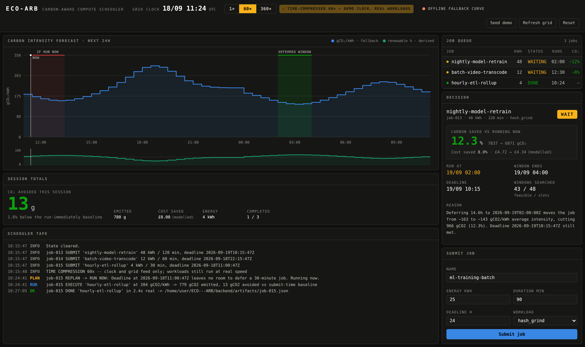

# ECO-ARB — Carbon-Aware Compute Scheduler

Defer deferrable compute to the cleanest half-hour the grid will offer before
your deadline. ECO-ARB pulls the UK grid's 24-hour carbon forecast, slides
every job's window across all 48 half-hour slots, and dispatches the job when
the carbon is lowest — then **actually runs the workload**.



---

## Quickstart

```bash
./start.sh          # backend :8000 + terminal :5173
```

Then open <http://127.0.0.1:5173>, press **Seed demo**, and flip the clock to
**360×**.

Or run the halves separately:

```bash
./backend/run.sh                      # FastAPI + APScheduler on :8000
cd frontend && npm install && npm run dev   # Vite terminal on :5173
```

Requires Python 3.11+ and Node 20+. No API key — the UK Carbon Intensity API
is open.

---

## What is real, and what is not

The honest version, because a carbon tool that fudges its carbon numbers is
worthless:

| Quantity | Status | Source |
|---|---|---|
| `intensity_gco2_kwh` | **Real** | `GET /intensity/fw24h` — 48 half-hour forecast slots |
| Job execution | **Real** | Actual CPU burned, artifact written to `backend/artifacts/`, digest independently verifiable |
| `renewable_pct` | **Derived** | Back-calculated from intensity by linear calibration (0 gCO₂/kWh → 95%, 400 → 5%). `/intensity/fw24h` carries no generation mix. |
| `price` | **Modelled** | The API carries no price at all. Scarcity term linear in intensity + a teatime demand peak. |
| Elapsed clock | **Compressed** | 1× / 60× / 360×, labelled on screen at all times |

**Carbon is the only thing optimised on.** Cost is scored on the same windows
and reported next to it, but never breaks a tie — there is a test
(`test_cost_is_reported_but_never_optimised`) that fails if it ever does.

The UI marks derived and modelled figures inline, and the chart legend flips
to `fallback` the moment the live feed is unavailable.

### Offline fallback

If the Carbon Intensity API is unreachable, the feed degrades to a synthetic
UK-winter-weekday curve (overnight wind trough, midday solar dip, hard evening
gas peak), every slot flagged `live: false`, and the header pill turns amber.
Conference wifi cannot kill the demo. The tape logs the reason.

---

## How the decision is made

For a job of duration *D* and energy *E*, the engine scores **every** feasible
start: "right now", plus the top of every forecast slot in the horizon.

```
carbon(start) = Σ_slots  E · (overlap_minutes / D) · intensity_slot
```

Energy is spread evenly across the window and each slot is weighted by the
fraction of the window it actually covers — a 45-minute job is not charged two
full half-hours. A window is feasible only if it ends on or before the
deadline.

```
carbon_saved_pct = (carbon(now) − carbon(best)) / carbon(now) · 100
```

The engine returns `WAIT` if the best window beats running now by more than
1% (`MIN_SAVING_PCT`), otherwise `RUN`. Ties go to the **earlier** window, so
a job never drifts later for no gain.

The scheduler **re-runs this every tick**, so a job already deferred to 02:00
will move if a fresh forecast finds something better — and only a genuine
change is written to the tape.

---

## Time compression

`1× / 60× / 360×`, switchable live and labelled in the header the whole time.

It compresses **the clock and the grid feed only.** The virtual clock decides
*when* a job starts; once started, the workload runs at real wall-clock speed.
So at 360× you watch a full day of grid conditions pass in four minutes while
a job still burns six real seconds of CPU — and the tape shows both.

Switching speed re-anchors rather than rescaling from the epoch, so the
displayed clock is continuous across the change and never jumps.

Because the 48 fetched slots span every half-hour of a day, the feed is
indexed by half-hour-of-day. The diurnal curve therefore stays correctly
phased to the displayed clock, and a 360× demo can run indefinitely without
outrunning the fetched window.

---

## The workload is genuinely executed

`executor.py` ships three workloads:

- **`hash_grind`** — chained SHA-256 plus a Merkle root over the chain. The
  result is independently checkable: `GET /api/jobs/{id}/artifact` recomputes
  the whole chain from the recorded seed and returns
  `independently_verified: true`.
- **`matrix_train`** — dense float matrix multiply in pure Python.
- **`shell`** — runs an actual external command. Gated behind the
  `ECO_ARB_SHELL_CMD` environment variable, so an exposed instance cannot be
  turned into a command runner by posting a job.

Work scales with `energy_kwh` (a 10 kWh job ≈ 6 seconds of real CPU here).
Tune with `ECO_ARB_WORK_SCALE` for a faster or slower machine.

---

## Contract

```jsonc
Job      { id, name, energy_kwh, deadline_iso, status }
Grid     { timestamp, intensity_gco2_kwh, renewable_pct, price }
Decision { job_id, action, run_at_iso, carbon_saved_pct, cost_saved_pct, reason }
```

Every contract field is present and spelled exactly as above. Three
extensions carry what the contract does not name but the system needs — a
window must have a width before you can slide it:

- `Job.duration_minutes`, `Job.workload`, plus execution bookkeeping
  (`run_at_iso`, `progress`, `result`, …)
- `Grid.live` — whether this slot came from the live API or the fallback
- `Decision.baseline_carbon_g` / `optimal_carbon_g` / `window_end_iso` /
  `feasible_windows` — the numbers behind the percentage

`status` ∈ `QUEUED | WAITING | RUNNING | DONE | FAILED | MISSED`,
`action` ∈ `RUN | WAIT`.

### Endpoints

| Method | Path | Purpose |
|---|---|---|
| `GET` | `/api/state` | Everything the terminal draws, one poll (1 Hz) |
| `POST` | `/api/jobs` | Submit a job; returns job + its immediate decision |
| `GET` | `/api/jobs/{id}` | One job and its current decision |
| `DELETE` | `/api/jobs/{id}` | Cancel a queued or waiting job |
| `GET` | `/api/jobs/{id}/artifact` | Execution artifact + independent verification |
| `POST` | `/api/speed` | Set time compression (1, 60, 360) |
| `POST` | `/api/grid/refresh` | Force a forecast re-pull |
| `POST` | `/api/demo/seed` | Three jobs exercising defer / run-now / deadline-bound |
| `POST` | `/api/reset` | Clear all state |

---

## Architecture

```
backend/app/
  main.py       FastAPI — one snapshot endpoint, polled at 1 Hz
  scheduler.py  APScheduler: grid refresh (real 5 min) + tick (real 1 s)
  engine.py     Exhaustive sliding window -> RUN | WAIT
  executor.py   Real workloads, real artifacts, thread pool
  carbon.py     Carbon Intensity client, phasing, fallback curve
  clock.py      Virtual clock, continuous across speed changes
  store.py      In-process state + log ring buffer
frontend/src/
  App.jsx                    Poll loop and layout
  components/ForecastChart   24h intensity, step path, annotation bands, hover
  components/RenewableStrip  Renewable share — its own chart, own axis
```

One snapshot endpoint polled at 1 Hz rather than SSE: a single code path that
survives a backend restart mid-demo without a reconnect dance.

---

## Tests

```bash
cd backend && ./.venv/bin/python -m pytest tests -q
```

Nine tests over the decision engine: fractional-slot energy weighting, deferral
to a trough, deadline-bound `RUN`, never scheduling past a deadline, the
sub-threshold no-op, tie-breaking toward the earlier window, and carbon
beating cost when the two disagree.

---

## Notes and limits

- State is in-process. Restarting the backend clears the queue — this is a
  36-hour hackathon build, not a durable scheduler.
- CORS is wide open for demo convenience; lock it down before exposing it.
- National UK figures only, no regional breakdown, no embodied carbon, no
  data-centre PUE.
- The scheduler assumes a job's power draw is flat across its window.
